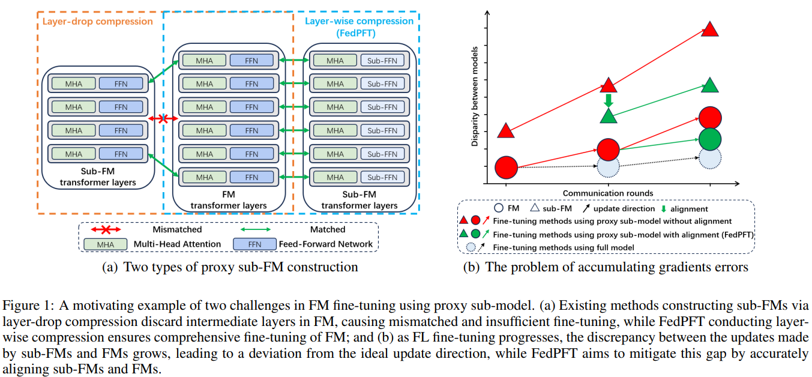
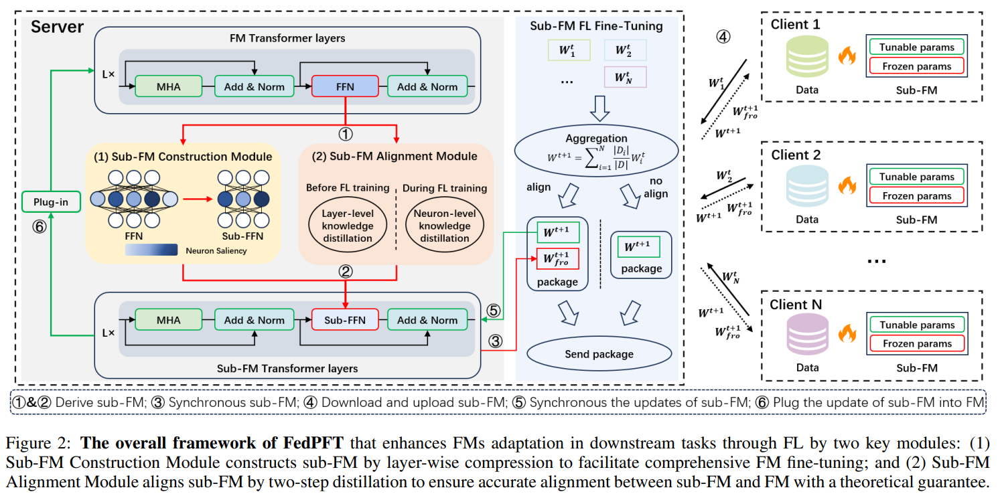
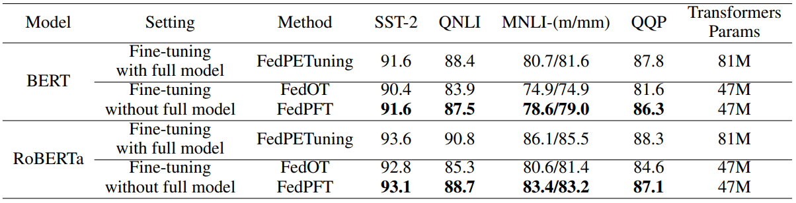
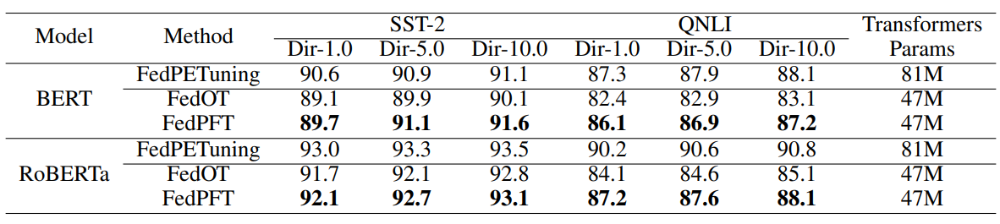
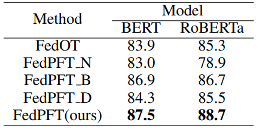
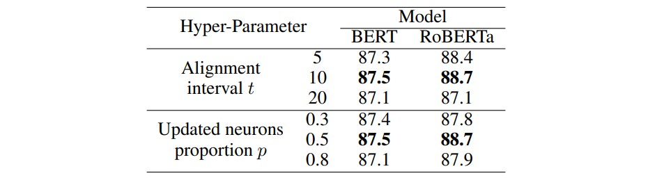

# FedPFT: Federated Proxy Fine-Tuning of Foundation Models

This is the official implementation of the IJCAI 2024 paper [FedPFT: Federated Proxy Fine-Tuning of Foundation Models](http://arxiv.org/abs/2404.11536).
## Abstract
Adapting Foundation Models (FMs) for downstream tasks through Federated Learning (FL) emerges a promising strategy for protecting data privacy and valuable FMs. Existing methods fine-tune FM by allocating sub-FM to clients in FL, however, leading to suboptimal performance due to insufficient tuning and inevitable error accumulations of gradients. In this paper, we propose Federated Proxy Fine-Tuning (FedPFT), a novel method enhancing FMs adaptation in downstream tasks through FL by two key modules. First, the sub-FM construction module employs a layer-wise compression approach, facilitating comprehensive FM fine-tuning across all layers by emphasizing those crucial neurons. Second, the sub-FM alignment module conducts a two-step distillations—layer-level and neuron-level—before and during FL fine-tuning respectively, to reduce error of gradient by accurately aligning sub-FM with FM under theoretical guarantees. Experimental results on seven commonly used datasets (i.e., four text and three vision) demonstrate the superiority of FedPFT.

## Overview
The overall framework of FedPFT is as follows. We first derive a proxy sub-FM for the server FM, then collaboratively fine-tune the sub-FM through FL, and finally synchronise the updates on the sub-FM to the FM by plugging-in. FedPFT enhances downstream tasks adaptation of FMs through FL by two key module: (1) Sub-FM Construction Module that constructs sub-FMs by performing layer-wise compression on FMs based on neuron saliency; and (2) Sub-FM Alignment Module that reduces the difference between FMs and sub-FMs by layer-level and neuron-level knowledge distillation before and during FL fine-tuning, respectively.

## Experiments

### Requirements
```
torch==2.1.0+cu118
torch_xla==2.3.0
torchvision==0.16.0+cu118
transformers==4.35.2
peft==0.5.0
flgo==0.1.4
matplotlib==3.7.3
numpy==1.24.1
pandas==2.2.2
scikit_learn==1.3.0
scipy==1.13.0
six==1.16.0
tqdm==4.66.1
```

### Sub-FM construction and distillation before federated fine-tuning
1. Place the pre-trained models used to conduct experiments in [pretrain models folder](pretrain_models)
2. Place the distillation datasets in [datasets folder](datasets)
3. `cd ./sub_model_construct` in the shell and run the file `distill.py` to get the distilled NLP sub-FM or run the file `distill_vit.py` to get the distilled CV sub-FM.
```shell
python -m accelerate.commands.launch --multi_gpu --num_processes=4 --main_process_port 25000 --num_machines 1 ./distill.py --model_checkpoint ../pretrain_models/roberta-base --per_device_train_batch_size 32 --learning_rate 6e-4 --logging_steps 0.05 --save_steps 0.1 --distill_epoch 5 --warm_up_ratio 0.048 --gradient_accumulation_steps 8 --layers_retained 0 11 --lr_scheduler_type linear --distill True --qk_rank 768 --intermediate_rank 768 --distill_alpha 0.01
```
The sub-FM will be stored in `sub_model_construct/sub_model`

### Federated fine-tuning
1. Place the downstream datasets in [datasets folder](datasets)
2. `cd ./federated_proxy_finetuning` in the shell and run the file `fedtune.py` to fine-tune the NLP FM or run the file `fedtune_cv.py` to fine-tune the CV FM.
```shell
python -m accelerate.commands.launch --multi_gpu --num_processes=4 --main_process_port 25000 --num_machines 1 ./fedtune.py --model_checkpoint ../pretrain_models/roberta-base --sub_model_checkpoint ../sub_model_construct/sub_model/sub-roberta-base-retained011-r1768-r2768 --partitioner iid --learning_rate 0.0008 --num_rounds 5 --align_interval 1 --align_epochs 0.02 --align_retained_ratio 0.5 --num_epochs 1 --lr_scheduler_type 2 --proportion 0.1 --eval_interval 1 --lora_rank 8 --lora_alpha 48 --per_device_train_batch_size 4 --gradient_accumulation_steps 1 --task_name sst2 --method pft
```
The fedtask generated by FLGo and experiments result of federated fine-tuning will be stored in `federated_proxy_finetuning/task` and `federated_proxy_finetuning/fed-result` respectively.

Please refer to [FLGo](https://github.com/WwZzz/easyFL) for federated learning scenario settings and [transformers](https://huggingface.co/docs/transformers) for model local training hyperparameter settings.

### Results
We conducted the experiment in four parts:
1. I.I.D scenarios:

2. Non-I.I.D scenarios:

3. Ablation study:

4. Parameter study:



## Citation
If you find our paper useful, please cite the paper:
```
@misc{peng2024fedpft,
      title={FedPFT: Federated Proxy Fine-Tuning of Foundation Models}, 
      author={Zhaopeng Peng and Xiaoliang Fan and Yufan Chen and Zheng Wang and Shirui Pan and Chenglu Wen and Ruisheng Zhang and Cheng Wang},
      year={2024},
      eprint={2404.11536},
      archivePrefix={arXiv},
      primaryClass={cs.LG}
}
```
