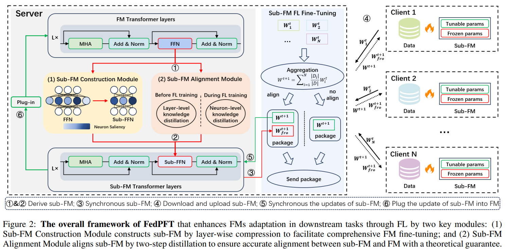
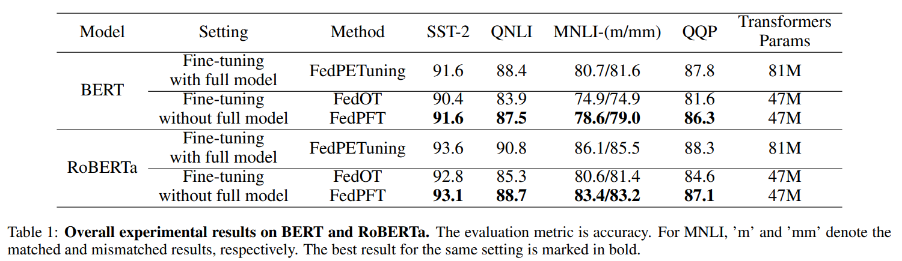

# FedPFT


This is the official implementation of the paper [FedPFT: Federated Proxy Fine-Tuning of Foundation Models], which is accepted by IJCAI 2024 conference (https://ijcai24.org).
**FedPFT** is a novel method enhancing FMs adaptation in downstream tasks through federated learning paradigm by two key modules.
* First, the sub-FM construction module employs a layer-wise compression approach, facilitating comprehensive FM fine-tuning across all layers by emphasizing those crucial neurons. 
* Second, the sub-FM alignment module conducts a two-step distillations—layer-level and neuron-level—before and during FL fine-tuning respectively, to reduce error of gradient by accurately aligning sub-FM with FM under theoretical guarantees. 

## Data
* 

## Results



## Citation
If you find our paper useful, please cite the paper:
```
@**********{
**********,
author={Zhaopeng Peng and Xiaoliang Fan and Yufan Chen and Zheng Wang and Shirui Pan and Chenglu Wen and Ruisheng Zhang andCheng Wang},
title={FedPFT: Federated Proxy Fine-Tuning of Foundation Models},
journal={IJCAI}
year={2024}
volume={**********}
doi={**********}
url={**********}
eprinttype={**********}
eprint={**********}
}
```
